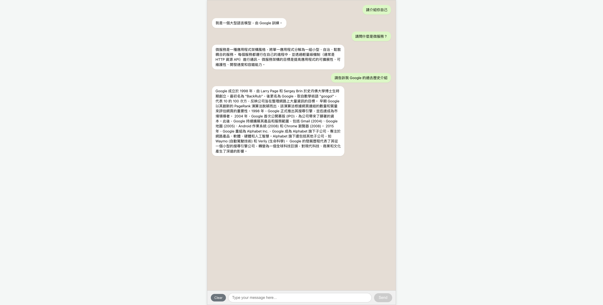
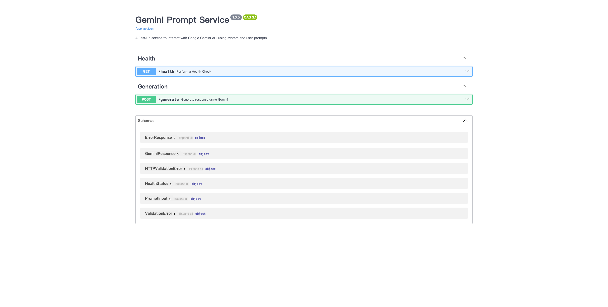

# gemini-code-assist-chatbot-service
Use Gemini Code Assistant to generate the code that can use the backend and frontend service to chat with Gemini API.




## 一、專案概述  
`gemini-code-assist-chatbot-service` 提供一套完整的即時聊天服務，以 Google Gemini API 為核心，結合 FastAPI 後端與 React/Nginx 前端，並透過 Docker Compose 進行整合與部署。主要功能包括：

- 接收使用者輸入的 prompt，經由 FastAPI 對接 Gemini 模型並回傳生成結果  
- 前端以 React 組件呈現對話介面，並由 Nginx 做為靜態資源伺服器  
- 全程以容器化方式管理，支援開發與生產環境快速切換  

## 二、系統架構  
```text
┌─────────────────┐    ┌─────────────────┐
│   React Frontend│◀───│   Nginx Proxy   │
│  (3000 → 80)    │    └─────────────────┘
└─────────────────┘            │
                               ▼
┌─────────────────┐    ┌─────────────────┐
│ FastAPI Backend │◀───│ Google Gemini   │
│  (8000)         │    │ API             │
└─────────────────┘    └─────────────────┘
       ▲
       │
  Docker Compose  
```

- **Backend**：Python 3.12 + FastAPI，整合 `google-generativeai` SDK  
- **Frontend**：React (Create React App) + Nginx  
- **容器管理**：Docker Compose v3.8  

## 三、前置需求  
- **Docker** ≥ 20.10  
- **Docker Compose** ≥ 1.29 (或 v2.0+)  
- **Node.js** ≥ 16.x (若需本機開發 React)  
- **Python** ≥ 3.12 (若需本機開發 FastAPI)  
- **Google API Key**：申請後置於 `backend-service/.env`  

## 四、快速啟動  

1. **取得原始碼**  
   ```bash
   git clone https://your-repo-url.git
   cd gemini-code-assist-chatbot-service
   ```

2. **設定環境變數**  
   於 `backend-service/.env` 新增：  
   ```
   GOOGLE_API_KEY=你的_API_KEY
   ```

3. **啟動服務**  
   ```bash
   docker-compose up --build -d
   ```

4. **驗證服務**  
   - **Health Check**：  
     ```bash
     curl http://localhost:8000/health
     # 回應：{"status":"ok"}
     ```  
   - **生成功能**：  
     ```bash
     curl -X POST http://localhost:8000/generate \
       -H "Content-Type: application/json" \
       -d '{"user_prompt":"請解釋微服務架構"}'
     # 回應範例：{"response":"…"}
     ```

## 五、開發模式  

- **後端熱重載**  
  - 可在 `docker-compose.yml` 中取消註解 `volumes`，並啟用 `uvicorn --reload`  
- **前端開發**  
  - 本機安裝依賴並執行  
    ```bash
    cd frontend-service
    npm install
    npm start
    ```  
  - 編譯後由 Nginx 提供靜態資源  

## 六、目錄結構  
```
.
├── LICENSE
├── README.md
├── docker-compose.yml
├── backend-service
│   ├── Dockerfile
│   ├── .dockerignore
│   ├── .env              ← 環境變數
│   ├── main.py
│   ├── requirements.txt
│   └── …                 
└── frontend-service
    ├── Dockerfile
    ├── public
    ├── src
    └── package.json
```

## 七、測試與監控  
- 建議整合 CI/CD 流程，包含：  
  - 後端單元測試（pytest）  
  - 前端端到端測試（Cypress／Jest）  
  - 安全性掃描與容器掃描  

## 八、授權條款  
本專案依照 MIT License 授權，可自由使用、修改及散佈，詳見 [LICENSE](LICENSE) 檔案。